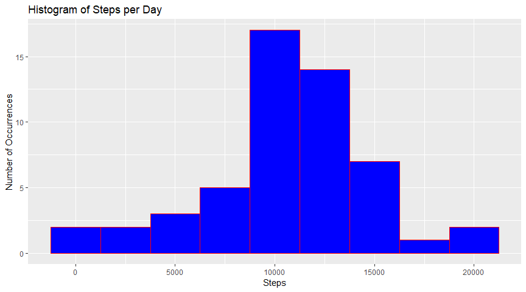
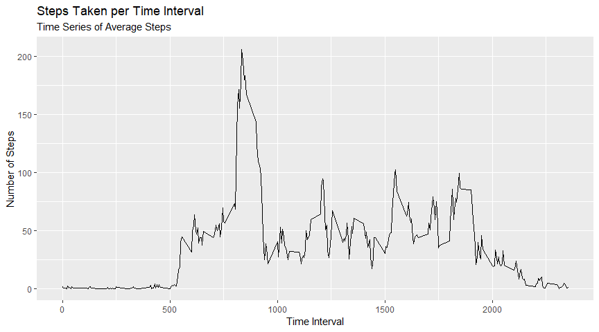
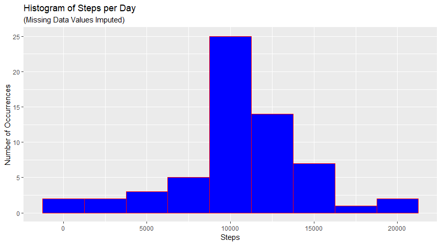
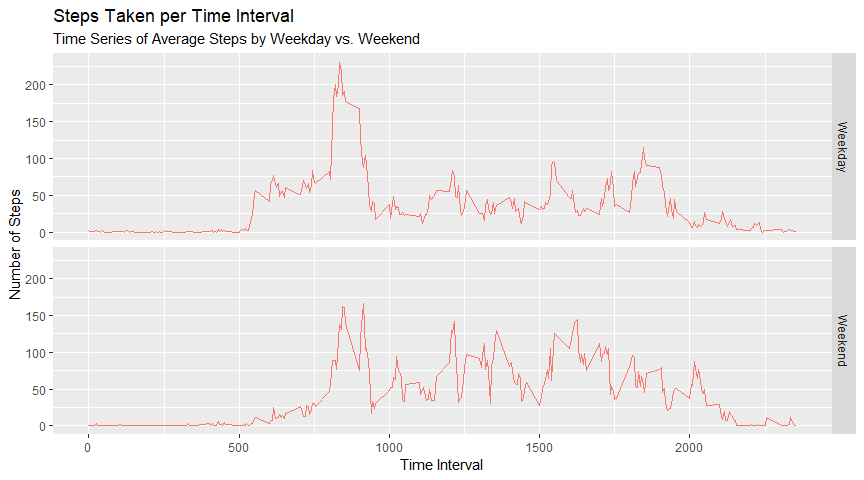

# Project Assignment

## Loading and Preprocessing the Data

(Show any code that is needed to load and, if necessary, process/transform the data into a format suitable for your analysis)

1. Load the data.


```r
setwd("C:\\Users\\bcoon\\Desktop\\Files\\Coursera\\")

the_data <- read.table(unz(".\\Data\\repdata_data_activity.zip",
                           "activity.csv" ), header = T, sep = ",")

print(summary(the_data))
```

```
##      steps                date          interval     
##  Min.   :  0.00   2012-10-01:  288   Min.   :   0.0  
##  1st Qu.:  0.00   2012-10-02:  288   1st Qu.: 588.8  
##  Median :  0.00   2012-10-03:  288   Median :1177.5  
##  Mean   : 37.38   2012-10-04:  288   Mean   :1177.5  
##  3rd Qu.: 12.00   2012-10-05:  288   3rd Qu.:1766.2  
##  Max.   :806.00   2012-10-06:  288   Max.   :2355.0  
##  NA's   :2304     (Other)   :15840
```


### What is the mean number of steps taken per day?
1.  Calculate the total number of steps per day:  
  (Aggregate the data by date to determine the total number of steps taken per day)


```r
the_agg_data <- aggregate(the_data$steps, by=list(Category = the_data$date), FUN=sum)

print(the_agg_data)
```

```
##      Category     x
## 1  2012-10-01    NA
## 2  2012-10-02   126
## 3  2012-10-03 11352
## 4  2012-10-04 12116
## 5  2012-10-05 13294
## 6  2012-10-06 15420
## 7  2012-10-07 11015
## 8  2012-10-08    NA
## 9  2012-10-09 12811
## 10 2012-10-10  9900
## 11 2012-10-11 10304
## 12 2012-10-12 17382
## 13 2012-10-13 12426
## 14 2012-10-14 15098
## 15 2012-10-15 10139
## 16 2012-10-16 15084
## 17 2012-10-17 13452
## 18 2012-10-18 10056
## 19 2012-10-19 11829
## 20 2012-10-20 10395
## 21 2012-10-21  8821
## 22 2012-10-22 13460
## 23 2012-10-23  8918
## 24 2012-10-24  8355
## 25 2012-10-25  2492
## 26 2012-10-26  6778
## 27 2012-10-27 10119
## 28 2012-10-28 11458
## 29 2012-10-29  5018
## 30 2012-10-30  9819
## 31 2012-10-31 15414
## 32 2012-11-01    NA
## 33 2012-11-02 10600
## 34 2012-11-03 10571
## 35 2012-11-04    NA
## 36 2012-11-05 10439
## 37 2012-11-06  8334
## 38 2012-11-07 12883
## 39 2012-11-08  3219
## 40 2012-11-09    NA
## 41 2012-11-10    NA
## 42 2012-11-11 12608
## 43 2012-11-12 10765
## 44 2012-11-13  7336
## 45 2012-11-14    NA
## 46 2012-11-15    41
## 47 2012-11-16  5441
## 48 2012-11-17 14339
## 49 2012-11-18 15110
## 50 2012-11-19  8841
## 51 2012-11-20  4472
## 52 2012-11-21 12787
## 53 2012-11-22 20427
## 54 2012-11-23 21194
## 55 2012-11-24 14478
## 56 2012-11-25 11834
## 57 2012-11-26 11162
## 58 2012-11-27 13646
## 59 2012-11-28 10183
## 60 2012-11-29  7047
## 61 2012-11-30    NA
```

2.   Make a histogram of the total number of steps taken each day (Chose ggplot to generate this histogram):


```r
library("ggplot2")
```

```
## Registered S3 methods overwritten by 'ggplot2':
##   method         from 
##   [.quosures     rlang
##   c.quosures     rlang
##   print.quosures rlang
```

```r
steps_per_day_hist <- ggplot(the_agg_data, aes(x)) + geom_histogram(binwidth = 2500, 
                              col = "red", fill="blue") + 
                              labs(x = "Steps", y = "Number of Occurrences",
                              title = "Histogram of Steps per Day")

print(steps_per_day_hist)
```

```
## Warning: Removed 8 rows containing non-finite values (stat_bin).
```

<!-- -->

3.  Calculate and report the mean and median of the total number of steps taken per day:  

##  Mean steps per day: 


```r
the_total_mean <- mean(the_agg_data$x, na.rm = TRUE)
print(the_total_mean)
```

```
## [1] 10766.19
```


##  Median steps per day: 


```r
the_total_median <- median(the_agg_data$x, na.rm = TRUE)
print(the_total_median)
```

```
## [1] 10765
```

#  Average Daily Activity Pattern

1. Time series plot of the 5 minute interval (x) and averaged number of steps taken averaged across all days (y)


```r
library("ggplot2")

the_intervals_agg <- aggregate(the_data$steps, list(the_data$interval), FUN = mean, na.rm = TRUE )

the_line_plot <- ggplot(the_intervals_agg, aes(x = Group.1, y = x)) + geom_line() +
                        labs(title = "Steps Taken per Time Interval", subtitle = 
                            "Time Series of Average Steps", y = "Number of Steps", 
                             x = "Time Interval")

print(the_line_plot)
```

<!-- -->

Based on the line plot shown above, the activity pattern exhibits the following tendencies: Sharp escalation of activity at roughly 0800, peaking at a level of 206 steps per five (5) minutes at 0835.  The activity then drops off sharply.  At roughly noon (1200), 4:00 p.m. (1600), and 6:00 p.m., activity exhibits small local maxima at around 100 steps/5 minutes before tailing off steeply after 8:00 p.m. (2000).


2.  Which 5-minute interval, on average across all the days in the dataset, contains the maximum number of steps?


```r
max_interval <- the_intervals_agg[which(the_intervals_agg$x == max(the_intervals_agg$x)),]

print(max_interval)
```

```
##     Group.1        x
## 104     835 206.1698
```

The daily five (minute interval containing the maximum number of steps thus occurs at 0835 with an average of 206.17 steps.

#  Imputing Missing Values

To do this, create a dataset with missing data ("NA" values) excluded, create a table of the aggregated means, and then fill in the missing values in the original dataset with the means from the aggregated dataset matched on the corresponding intervals.

1.  Calculate and report the total number of missing values in the dataset:
To do this, simply calculate the number of rows with missing values for the "steps" column value (This value is also available from visual inspection of the summary() operation on the original dataset above):


```r
num_na_rows <- nrow(the_data[is.na(the_data$steps), ])

print(num_na_rows)
```

```
## [1] 2304
```

2.  Devise a strategy for filling in all of the missing values in the dataset. The strategy does not need to be sophisticated. For example, you could use the mean/median for that day, or the mean for that 5-minute interval, etc.
3.  Create a new dataset that is equal to the original dataset but with the missing data filled in.  

To fulfill steps 2. and 3., create a dataset with missing data ("NA" values) excluded, create a table of the aggregated means, and then fill in the missing values in the original dataset with the means from the aggregated dataset matched on the corresponding intervals.


```r
the_new_data <- na.omit(the_data)
the_new_agg_data <- aggregate(the_new_data$steps, list(the_new_data$interval), mean)
the_final_data <- the_data
the_final_data$step_count <- ifelse(is.na(the_final_data$steps), the_new_agg_data$x[match(the_final_data$interval, 
                                     the_new_agg_data$Group.1)], the_final_data$steps)
the_final_data$steps <- round(the_final_data$step_count,0)

the_final_agg_data <- aggregate(the_final_data$steps, list(the_final_data$date), sum)
print(str(the_final_data))
```

```
## 'data.frame':	17568 obs. of  4 variables:
##  $ steps     : num  2 0 0 0 0 2 1 1 0 1 ...
##  $ date      : Factor w/ 61 levels "2012-10-01","2012-10-02",..: 1 1 1 1 1 1 1 1 1 1 ...
##  $ interval  : int  0 5 10 15 20 25 30 35 40 45 ...
##  $ step_count: num  1.717 0.3396 0.1321 0.1509 0.0755 ...
## NULL
```

4.  Make a histogram of the total number of steps taken each day and Calculate and report the mean and median total number of steps taken per day. 


```r
library("ggplot2")

imputed_data_hist <- ggplot(the_final_agg_data, aes(x)) + geom_histogram(binwidth = 2500, 
                            col = "red", fill="blue")

imputed_data_hist <- imputed_data_hist + labs(x = "Steps", y = "Number of Occurrences",
                              title = "Histogram of Steps per Day",
                              subtitle = "(Missing Data Values Imputed)")

print(imputed_data_hist)
```

<!-- -->

##  Mean steps per day using imputed md data: 


```r
the_total_md_mean <- mean(the_final_agg_data$x, na.rm = TRUE)

print(the_total_md_mean)
```

```
## [1] 10765.64
```

This value differs very slightly from the data computed above without missing data imputation: 10766.19 vs 10765.64, barely one (1) step difference.

##  Median steps per day using imputed md data: 


```r
the_total_md_median <- median(the_final_agg_data$x, na.rm = TRUE)

print(the_total_md_median)
```

```
## [1] 10762
```

Again, this value differs very slightly from the data computed above without missing data imputation: 10765 vs 10762, only three (3) steps difference.

In this particular example, the impact of imputing missing data on the estimates of the total daily number of steps is minimal.


#  Weekend and Weekday Activity Differences:

1.  Create a new factor variable in the dataset with two levels – “weekday” and “weekend” indicating whether a given date is a weekday or weekend day.


```r
the_final_data$day_type <- weekdays(as.Date(the_final_data$date))

the_final_data$day_type <- ifelse(the_final_data$day_type == "Saturday" | the_final_data$day_type == "Sunday",
                                    "Weekend", "Weekday")
print(str(the_final_data))
```

```
## 'data.frame':	17568 obs. of  5 variables:
##  $ steps     : num  2 0 0 0 0 2 1 1 0 1 ...
##  $ date      : Factor w/ 61 levels "2012-10-01","2012-10-02",..: 1 1 1 1 1 1 1 1 1 1 ...
##  $ interval  : int  0 5 10 15 20 25 30 35 40 45 ...
##  $ step_count: num  1.717 0.3396 0.1321 0.1509 0.0755 ...
##  $ day_type  : chr  "Weekday" "Weekday" "Weekday" "Weekday" ...
## NULL
```

2.  Make a panel plot containing a time series plot (i.e. \color{red}{\verb|type = "l"|}type="l") of the 5-minute interval (x-axis) and the average number of steps taken, averaged across all weekday days or weekend days (y-axis). 


```r
library("ggplot2")

the_daytype_agg <- aggregate(step_count ~ interval + day_type, data = the_final_data, 
                             FUN = mean, na.action = na.omit)

the_daytype_line_plot <- ggplot(the_daytype_agg, aes(x = interval, y = step_count, col = "red")) + 
    geom_line() +
    labs(title = "Steps Taken per Time Interval", subtitle = 
         "Time Series of Average Steps by Weekday vs. Weekend", y = "Number of Steps", 
       x = "Time Interval") + facet_grid(day_type ~ .) + theme(legend.position = "none")

print(the_daytype_line_plot)
```

<!-- -->

As can be seen above, the time series' of average steps by weekday and by weekend exhibit some similarities and also some differences:

Similarities: Activity picks up in the morning to peak at afound 0835 in both datasets.  Both datasets exhibit several additional, smaller spikes of activity throughout the day before falling off in the evening.

Differences:  Activity levels peak at a lower value on weekends, though the subsequent daily peaks are higher in value than those found on weekedays.  Weekend activity also features an additional spike just after 8:00 p.m. (2000), possibly attributable to weekend nightlife activity.

Examining the reasons for these differences should provide fruitful areas for research.
